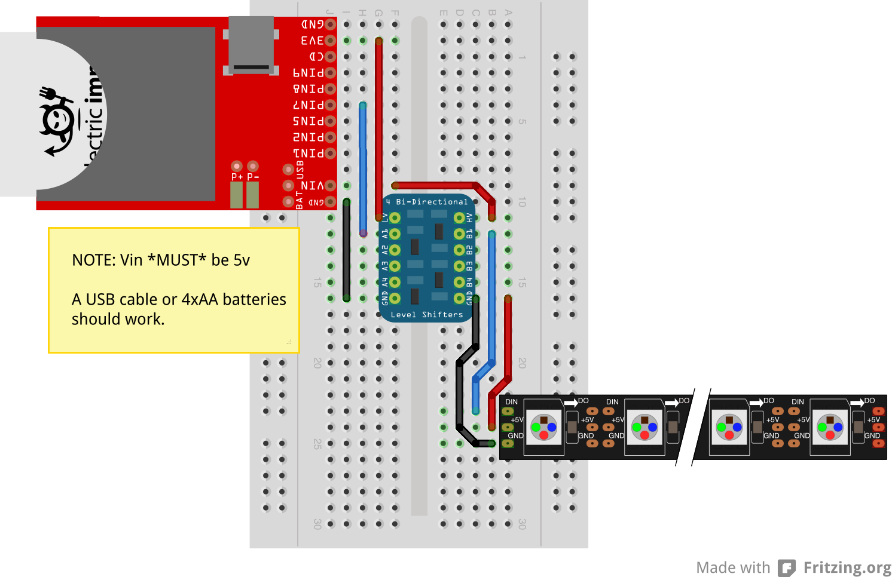

# WS2812 Class

This class allows the imp to drive WS2812 and WS2812B LEDs. The WS2812 is an all-in-one RGB LED with integrated shift register and constant-current driver. The parts are daisy-chained, and a proprietary one-wire protocol is used to send data to the chain of LEDs. Each pixel is individually addressable and this allows the part to be used for a wide range of effects animations.

Some example hardware that uses the WS2812 or WS2812B:

* [40 NeoPixel Matrix](http://www.adafruit.com/products/1430)
* [60 LED - 1m strip](http://www.adafruit.com/products/1138)
* [30 LED - 1m strip](http://www.adafruit.com/products/1376)
* [NeoPixel Stick](http://www.adafruit.com/products/1426)

## Hardware

WS2812s require a 5V power supply and logic, and each pixel can draw up to 60mA when displaying white in full brightness, so be sure to size your power supply appropriatly. Undersized power supplies (lower voltages and/or insufficent current) can cause glitches and/or failure to produce and light at all.

Because WS2812s require 5V logic, you will need to shift your logic level to 5V. A sample circuit can be found below using Adafruit’s [4-channel Bi-directional Logic Level Converter](http://www.adafruit.com/products/757):



## Class Usage

### constructor(spiBus, numPixels)

Instantiate the class with a pre-configured SPI object and the number of pixels that are connected. The SPI object must be configured at 7500kHz and have the *MSB_FIRST* flag set:

```squirrel
#require "ws2812.class.nut:2.0.0"

// Configure the SPI bus
spi <- hardware.spi257;
spi.configure(MSB_FIRST, 7500);

// Instantiate LED array with 5 pixels
pixels <- WS2812(spi, 5);
```

### set(*index, color*)

The *set* method changes the color of a particular pixel in the frame buffer. The color is passed as as an array of three integers between 0 and 255 representing `[red, green, blue]`.

NOTE: The set method does not output the changes to the pixel strip. After setting up the frame, you must call `draw` (see below) to output the frame to the strip.

```squirrel
// Set each pixel individually
pixels.set(0, [127,0,0]);
pixels.set(1, [0,127,0]);
pixels.set(2, [0,0,127]);
pixels.set(3, [0,127,0]);
pixels.set(4, [127,0,0]);

// Output the frame
pixels.draw();
```

### fill(*color, [start], [end]*)

The *fill* methods sets all pixels in the specified range to the desired color. If no range is selected, the entire frame will be filled with the specified color.

NOTE: The set method does not output the changes to the pixel strip. After setting up the frame, you must call `draw` (see below) to output the frame to the strip.

```squirrel
// Turn all LEDs off
pixels.fill([0,0,0]);

// Output the frame
pixels.draw();
```

```squirrel
// Set half the array red
pixels.fill([255,0,0], 0, 2);

// Set the other half blue
pixels.fill([0,0,255], 3, 4);

// Output the frame
pixels.draw();
```

### draw()

The *draw* method draws writes the current frame to the pixel array.

## License

The WS2812 class is licensed under the [MIT License](./LICENSE).
